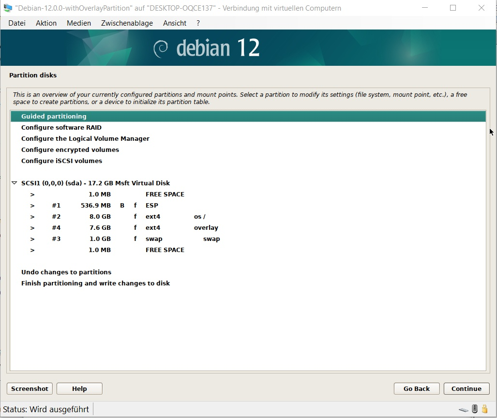

# How to put an overlay on top of the root file system

This document describes how to put an overlay on top of the root file system.

When you install Debian with default partition settings, the following partitions get created:

    NAME   MAJ:MIN RM  SIZE RO TYPE MOUNTPOINTS
    sda      8:0    0   10G  0 disk
    ├─sda1   8:1    0  512M  0 part /boot/efi
    ├─sda2   8:2    0  8.5G  0 part /
    └─sda3   8:3    0  976M  0 part [SWAP]
    sr0     11:0    1 1024M  0 rom

To put an overlay on top of the root file system, one more partition is required where the overlay gets stored. In the following example sda4 is the one getting used for the overlay.

    NAME   MAJ:MIN RM  SIZE RO TYPE MOUNTPOINTS
    sda      8:0    0   16G  0 disk
    ├─sda1   8:1    0  512M  0 part /boot/efi
    ├─sda2   8:2    0  7.5G  0 part /
    ├─sda3   8:3    0  976M  0 part [SWAP]
    └─sda4   8:4    0  7.1G  0 part
    sr0     11:0    1 1024M  0 rom
   
The following screenshot contains shows the manual partition configuration in the Debian installation menu. The additional partition is the one called "overlay".

To use the overlay a customized initramfs needs to get created. The following step can get used to do it:

1.  `mkdir --parents /root/initramfs`
2.  `mkinitramfs -o /root/initramfs/bash.img`
3.  `dd if=/root/initramfs/bash.img of=/root/initramfs/trailer skip=$(cpio -i -t -F /root/initramfs/bash.img 2>&1| head -n1 | awk '{print $1}')`
4.  `zstd -d /root/initramfs/trailer -o /root/initramfs/trailer.decompressed`
5.  `cpio -i --to-stdout -F /root/initramfs/trailer.decompressed scripts/local > /root/initramfs/local`
6.  Replace the code of the function local_mount_root in /root/initramfs/local by the code provided in scripts_local_with_overlay_on_hdd.txt
7.  `cp /root/initramfs/local /etc/initramfs-tools/scripts/overlay`
8.  `mkinitramfs -o /boot/overlay.img`
9.  Copy [40_custom](40_custom) to /etc/grub.d.
10. `grub-mkconfig -o /boot/grub/grub.cfg`
11. Reboot
12. Select 'Debian GNU/Linux with overlay' in boot menu.